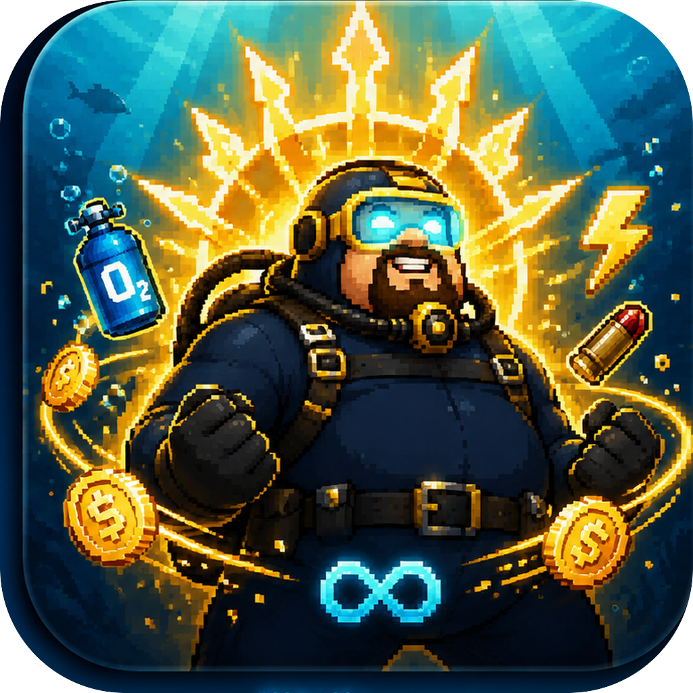

# DaveTheTrainer

<p align="center">
  
</p>

<p align="center">
  Manifest-backed macOS trainer for <code>DAVE THE DIVER</code>.
</p>

<p align="center">
  <a href="README.zh-CN.md">Chinese README</a> ·
  <a href="https://github.com/Empress7211/DaveTheTrainer/releases/latest">Download latest release</a>
</p>

DaveTheTrainer is a native macOS trainer for `DAVE THE DIVER`, built as a
SwiftPM and SwiftUI app with a manifest-backed safety model.

It is intentionally not a general memory scanner. Player-facing actions are
bound to reviewed manifest feature IDs, a validated Mach-O module shape,
reviewed patch points, and documented runtime object paths. The known game
build is a validated baseline profile. Installation discovery is relocatable,
but memory writes require an exact reviewed profile.

> This project is not affiliated with, endorsed by, or sponsored by MINTROCKET,
> Nexon, or the creators of `DAVE THE DIVER`.

## Project Status

| Area | Status |
| --- | --- |
| Platform | macOS |
| App type | Native SwiftUI app |
| Package manager | Swift Package Manager |
| Validated baseline build | `v1.0.6.675.mac` |
| Evidence-backed partial build | `v1.0.6.710.mac` |
| Target module | `GameAssembly.dylib` |
| Manifest schema | `1.0` |
| Test coverage | XCTest coverage for manifest policy, patch transactions, runtime incrementers, release scripts, and player path contracts |
| License | MIT |

## Download

Prebuilt app zips are published on
[GitHub Releases](https://github.com/Empress7211/DaveTheTrainer/releases).

Current release artifacts are ad-hoc signed and not Apple-notarized. macOS may
show an unidentified-developer warning on first launch. Review the source and
release notes before running the app.

Install from a release zip:

1. Download `DaveTheTrainer-v0.1.4-macOS.zip` from the latest release.
2. Unzip it.
3. Move `DaveTheTrainer.app` to `/Applications` or `$HOME/Applications`.
4. Start the supported macOS build of `DAVE THE DIVER`.
5. Open `DaveTheTrainer.app`.

If Gatekeeper blocks the first launch, use Finder's right-click `Open` flow. If
you intentionally trust the downloaded artifact after reviewing it, you can also
remove quarantine:

```bash
xattr -dr com.apple.quarantine /Applications/DaveTheTrainer.app
```

## Compatibility Boundary

This repository's fully validated profile is `v1.0.6.675.mac`. It also contains
an evidence-backed partial profile for `v1.0.6.710.mac`, derived from the
compatibility report attached to issue #2. The trainer may be installed
anywhere, and it resolves Steam custom libraries and standalone Unity bundles
from the running process. This path flexibility does not make fixed patch RVAs
portable across game updates.

| Game build | Coverage |
| --- | --- |
| `v1.0.6.675.mac` | Full baseline profile |
| `v1.0.6.710.mac` | Exact targets for god mode, oxygen, ammo, crab traps, weight, drones, stamina, and wasabi; other controls are disabled |

The `.710` targets are byte-verified against the reporter's GameAssembly and
guarded by its exact UUID. They have not been behavior-tested on the maintainer's
machine because that game build is not locally available. Enable its supported
features individually and treat `bytesApplied` as distinct from in-game
behavior confirmation. See [the evidence note](docs/compatibility-v1.0.6.710.mac.md).

Player memory writes require the manifest's exact bundle ID, version, build
GUID, and GameAssembly arm64 UUID. An unknown build remains detectable and can
be attached for diagnostics, but player writes are rejected before a stale RVA
is read or modified. Use **Export Compatibility Report** to create a local JSON
with targeted evidence for adding another exact build profile. The export is an
explicit user action and is never uploaded automatically.

## What It Can Do

DaveTheTrainer focuses on safe, repeatable player operations for the supported
build:

- Diving patches: god mode, oxygen, ammo, crab traps, weight, damage, drones,
  and swim speed.
- Currency operations: gold, Bei, jungle gold, and artisan flame.
- Inventory operations: main ingredients, category ingredients, Jungle DLC
  existing inventory, and Sea People / jungle village existing items.
- Sushi bar patches: stamina and wasabi.

Inventory features only modify existing entries unless the manifest explicitly
documents creation support. Missing roots, missing entries, target mismatches,
and verification failures are reported as failures instead of being silently
ignored.

## Design Principles

- Manifest first: player buttons map to reviewed manifest feature IDs.
- Exact-profile writes: build identity and GameAssembly UUID must match a
  reviewed profile before player memory operations begin.
- Evidence-driven compatibility: unsupported builds export targeted local
  diagnostics instead of guessing or scanning for replacement write targets at
  runtime.
- No silent fallback: failures surface as explicit errors, logs, or test
  failures.
- Transactional patching: multi-point patch groups preflight targets and roll
  back when a later write fails.
- Readback verification: runtime quantity writes must prove that the requested
  value changed.
- Public boundary: extracted game binaries, memory dumps, save fixtures, logs,
  and signing material are not part of this repository.

## Requirements

- macOS 14 or newer.
- Xcode command line tools with Swift 5.9 or newer.
- A local macOS IL2CPP installation of `DAVE THE DIVER`; `v1.0.6.675.mac` is
  the validated baseline profile.
- Permission to attach to the running game process when using trainer actions.

## Build From Source

```bash
git clone https://github.com/Empress7211/DaveTheTrainer.git
cd DaveTheTrainer
swift test
./script/build_and_run.sh
```

`script/build_and_run.sh` builds the SwiftPM executable, stages a real
`DaveTheTrainer.app` bundle, signs it, copies the latest app to
`${DAVE_TRAINER_LOCAL_APP_DIR:-$HOME/Applications}`, mirrors the artifact under
`dist/`, creates `dist/DaveTheTrainer-v0.1.4-macOS.zip`, and launches the app.

To choose a different local app destination:

```bash
DAVE_TRAINER_LOCAL_APP_DIR="$HOME/Desktop/DaveTheTrainerBuild" ./script/build_and_run.sh
```

Useful script modes:

| Command | Purpose |
| --- | --- |
| `./script/build_and_run.sh` | Build, package, and launch the app |
| `./script/build_and_run.sh --verify` | Build, package, launch, verify signing, and confirm the process starts |
| `./script/build_and_run.sh --package` | Build and print the local `.app` path |
| `./script/build_and_run.sh --release-package` | Produce a release zip with release build settings |
| `./script/build_and_run.sh --logs` | Launch and stream unified logs for the app process |
| `./script/build_and_run.sh --telemetry` | Launch and stream app subsystem logs |

Release packages require an explicit signing identity:

```bash
DAVE_TRAINER_SIGN_IDENTITY="Developer ID Application: Example (TEAMID)" \
  ./script/build_and_run.sh --release-package
```

## Using The App

1. Start the macOS build of `DAVE THE DIVER`.
2. Launch `DaveTheTrainer`.
3. Confirm that the app detects the game process and build fingerprint.
4. If the build is unsupported, click **Export Compatibility Report** and
   attach the JSON to the compatibility issue; no player writes will run.
5. On a partial profile, controls without exact evidence are disabled. Test the
   enabled controls individually rather than using a combined mode.
6. On a supported build, apply only the one-click trainer operation you intend
   to use.
7. If macOS asks for administrator authorization, review the prompt and allow
   it only for the trainer attach/read/write operation.

The trainer derives the actual `.app` from the running game executable first,
so Steam custom libraries, locations outside `/Applications`, and standalone
Unity app bundles are supported. A name-matched process remains only a
candidate: `CFBundleExecutable`, `com.nexon.dave`, IL2CPP metadata, and
`GameAssembly.dylib` must still validate before attach. The fixed
`/Applications/DaveTheDiver.app` location is checked only when the game is not
running.

`Install Not Resolved` means that a process was found but its app bundle did
not pass installation validation. It is distinct from `Game Not Running` and
does not by itself mean that the version number is unsupported.

The app fails loudly when the game is missing, the build or target module does
not match a reviewed profile, a feature target cannot be validated, permission
is denied, or readback verification fails.

## Permissions And Privacy

DaveTheTrainer modifies a running local game process. macOS can require
administrator authorization for task access and process memory writes.

The app does not upload telemetry, memory dumps, save files, API keys, crash
logs, or diagnostics. The compatibility exporter writes a local JSON containing
build fingerprints and targeted manifest byte samples. It omits absolute
paths and full extracted symbol names. Other logs or manually collected data
should still be redacted before publication.

See [Permissions And Privacy](docs/permissions-and-privacy.md) for the detailed
policy.

## Repository Layout

```text
Sources/
  DaveTrainerApp/      SwiftUI app, stores, views, and presentation logic
  TrainerCore/         Manifest, patching, scanning, runtime, and save services
  MachMemory/          C bridge for Mach task memory access
Tests/
  DaveTrainerAppTests/ Player path, release script, and app service contracts
  TrainerCoreTests/    Core patching, manifest, scanner, and runtime tests
docs/                  Public policy, release, and capability notes
script/                Build, release, and legacy admin helper scripts
Assets/                App icon assets
```

## Development Workflow

Run the full test suite before publishing changes:

```bash
swift test
```

GitHub Actions runs the public suite and explicitly skips tests that require a
local `DAVE THE DIVER` installation or extracted proprietary game files:

```bash
swift test \
  --skip InstalledGameIntegrationTests \
  --skip Il2CppFeatureLocatorTests \
  --skip MachOModuleResolverTests
```

Feature changes should follow the manifest-first workflow:

1. Document the target feature in `DaveTrainerManifest`.
2. Add tests for unknown-build rejection, target mismatch, write failure,
   verify failure, and success.
3. Implement the smallest validated patch point or runtime object path.
4. Keep game-specific addresses and offsets in this project.
5. Keep development discovery code behind explicit diagnostics.

Do not add mock success paths, unverified compatibility guesses, unbounded
runtime scanning fallbacks, or player buttons that rely on unreviewed discovery
output.

## Documentation

- [Contributing](CONTRIBUTING.md)
- [Security](SECURITY.md)
- [Changelog](CHANGELOG.md)
- [Release Checklist](docs/release-checklist.md)
- [Resource Capabilities](docs/resource-capabilities.md)
- [Inventory Taxonomy](docs/inventory-taxonomy.md)
- [Development Fixtures](docs/development-fixtures.md)
- [v1.0.6.710.mac Compatibility Evidence](docs/compatibility-v1.0.6.710.mac.md)

## Security

Please report security issues privately to the maintainer before public
disclosure. See [Security](SECURITY.md) for the project scope.

## License

DaveTheTrainer is released under the [MIT License](LICENSE).
